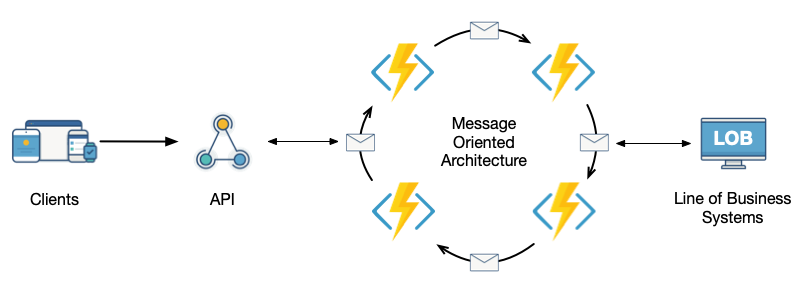

## Getting Started

| Table of Contents |
| --- |
| [Introduction](introduction.html) |
| [Simple Message Oriented Language](smol.html) |
| [Scenarios](scenarios.html) |
| [Frontmatter](frontmatter.html) |

The MOAR architecture fits best in front of your line of business applications and behind an API. It is a backend architecture that helps you connect systems together, handling high load and while being easy to maintain.

A simplification is that MOAR is a microservice architecture that scales down. It doesn't require several teams for you to benefit of the modularization. You can get by with one team, and still get value from the MOAR architecture.

### Why you should pick MOAR

These are a couple of reasons that you should consider MOAR

1. Your software design would greatly benefit from modularizing into independent functions that communicate through strong typed interfaces.
2. Your software product goes beyond simple CRUD operations and needs to react on state changes and events happening in your system.
3. The number of API requests has passed the resonable amount of load that your LOB and CRUD system can manage.
4. You only have 1-2 teams right now working on the system, but you expect to have many more teams in a near future.
5. You need to build resilience in, because your LOB system's are unreliable.

### Reasons to build a monolith instead

Never underestimate the complexity of a distributed system

1. If all you're doing is CRUD operations, there is most likely no need for a distributed architecture like MOAR
2. You only have a small team and you're not expecting to scale out to several teams in a near future
3. The tools you have for scaling out and scaling up is enough for the load you're getting from users
4. The number of systems that needs integrating is limited to a few

### Reasons to build a microservice system instead

1. You are already 2 or more teams working on the system and expect to grow.
2. There are many different competences coming together, and the strength of choosing different technology for different services is important
3. You have the capability to deal with each service as their own application lifecycle
4. Your development team is distributed on different departments that own their own services in your microservice system

[Next / Introduction &raquo;](introduction.html)