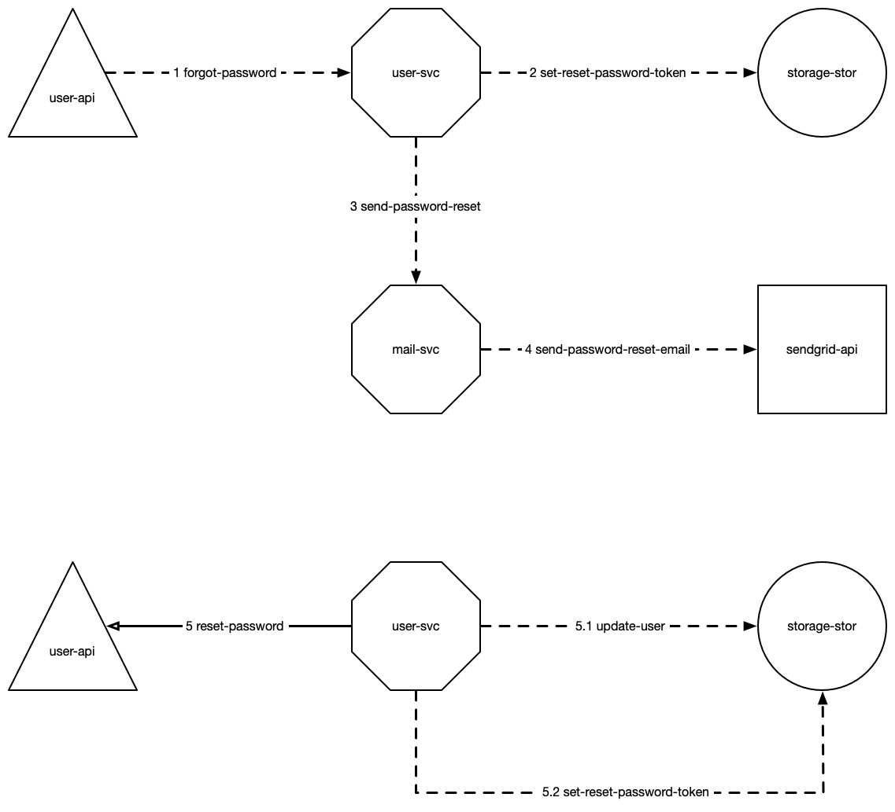

## Scenarios

Now that we have a design language we can use it to craft our scenarios. This makes it easy to communicate system design. All achitects, developers are using the same language to conferr ideas on how your system should solve a problem.

Here is an example scenario. A user has forgot their password and request a password change.

```smol
---
title: Forgot password
---

###
# User enter their e-mail into a form and post it to the user-api
###

# user-api commands a forgot password message to user-svc
{user-api} forgot-password --> <user-svc>

# user-svc store a reset password token to user-stor
<user-svc> set-reset-password-token --> (user-stor)

# user-svc send reset password e-mail, with token to user
<user-svc> send-password-reset --> <mail-svc>

# mail-svc use sendgrid to send a HTML formatted password reset e-mail
<mail-svc> send-password-reset-email --> [sendgrid-api]

###
# User recieves e-mail and click link to website, with password reset token as query parameter
###

# user-api requests a password request, that user-svc responds to
{user-api} reset-password >>= password-reset-result <user-svc>

	
	# update the user password
	update-user --> (user-stor)
	
	# if token is found it should be removed to avoid reuse
	set-reset-password-token --> (user-stor)
```

A lot of things are going on there. Let's take a look at it bit by bit.

```smol
---
title: Forgot password
---
```

This is called frontmatter and it gives context to the scenario. Here we only specify the title of the scenario. The frontmatter is where you can extend the scenarios with your own metadata.

```smol
###
# User enter their e-mail into a form and post it to the user-api
###
```

This is a comment. It gives context to what happened before this scenario.

```smol
# user-api commands a forgot password message to user-svc
{user-api} forgot-password --> <user-svc>
````

An API called `user-api` has been called, and it now issues a `forgot-password` message, sent as a command to `user-svc`. This means that the API will not expect a result from `user-svc`. Once this is done it will report back to the web interface that the user should expect an e-mail.

The contents of the `forgot-password` message is the users e-mail address. This is not communicated in the design language, but can be added to the frontmatter if it's important to the reader.

```smol
# user-svc store a reset password token to user-stor
<user-svc> set-reset-password-token --> (user-stor)
````

What the `user-svc` will do next, is to generate a reset password token, that it will store on the user profile.

It will do this asynchronously. There is no garantuee that it will happen immediatley or after 1 minute.

```smol
# user-svc send reset password e-mail, with token to user
<user-svc> send-password-reset --> <mail-svc>
````

After the password reset token has been set, it will ask the `mail-svc` to send a password reset e-mail to the client. The `send-password-reset` message contains the user e-mail, and reset password token.

```smol
# mail-svc use sendgrid to send a HTML formatted password reset e-mail
<mail-svc> send-password-reset-email --> [sendgrid-api]
````

The `mail-svc` will make this into a service call to `sendgrid-api`. It will pick out the reset password e-mail template, send the password reset token as data to the template and the user e-mail as recipient.

```smol
###
# User recieves e-mail and click link to website, with password reset token as query parameter
###
````

Instead of creating a new scenario for getting the reset password request, we can just indicate in the scenario with a comment that a user action is required.

```smol
# user-api requests a password request, that user-svc responds to
{user-api} reset-password >>= password-reset-result <user-svc>
````

This time the API need to tell the web interface if the password reset was successful or not. The `reset-password` message contains the password reset token from the e-mail and the new password.

The `user-api` will wait for `user-svc` to complete the password reset, because it is synchronous. During the password reset the `user-svc` will do the following operations. That is why they are indented.

```smol	
	# update the user password
	update-user --> (user-stor)
	
	# if token is found it should be removed to avoid reuse
	set-reset-password-token --> (user-stor)
````

Notice that these do not have to state `user-svc` as the origin service, because they are indented under the `user-svc` so this is implicit.

When all the operations in the indentation is done, it will return the `password-reset-result` to report to the `user-api` that the reset was successful.

Here's how this looks in the graphical design language.




[Next / Frontmatter &raquo;](frontmatter.html)