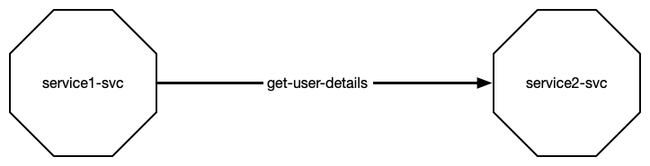
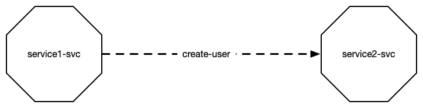
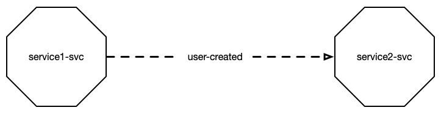
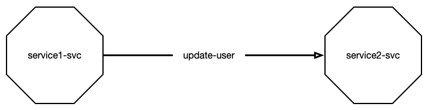

## SMOL - Small Message Oriented Language

By defining the system parts as Services, Functions, Storage and the interconnections as Queries, Commands, Subscriptions and Requests, will let us define a language for the design of our system.

This language is graphical in its nature, but it has an ASCII component that let's you parse and build tools around it.

The language is called SMOL.

In this language we have the following system parts.


A service is represented by a hexagon. A storage is a circle, external system is a square and an API that is fronting the MOAR system is a triangle. All other API's are considered external.

Functions are not represented in the design, but implicit in the service. More about that later.

This is how they are represented in ASCII.

```smol
# a service in the MOAR system
<service-svc>

# a storage in MOAR
(storage-stor)

# an external system
[erp-database]

# an api that is fronting the MOAR system
{user-api}
```

We have two orthogonal ways to communicate messages between services. We can do it synchronous/asynchronous and consuming/observing. This gives us 4 different options to connect services.

### Query

The query is a synchronous consuming message passing. Because it is synchronous it represents with a solid line, and because it is consuming it is represented with a solid arrow head.

On the arrow you type out the name of the message that is being passed. Since this is a synchronous message passing, we also type out the message being returned.



If we don't want to use `newline` on our arrow, we could separate message names with `/` character.

This is how a query is represented in ASCII.

```smol
# service1 query service2 with get-user-details, and service2 returns user-details-result
<service1-svc> get-user-details ==> user-details-result <service1-svc>
```

Notice the `==>` operator indicates a query. The message passed is written before the operator, and the message returned is written after the operator.

### Command

The command is an asynchronous consuming message passing. It is asynchronous because we do not expect a result back. It is consuming because service 1 send the command to service 2.

The arrow line is dashed to indicate that the message is asynchronous. The arrow head is solid to indicate that it is consuming.



This is a command arrow. And here's how it is represented in ASCII.

```smol
# service 1 commands service 2 to save the user
<service1-svc> create-user --> <service2-svc>
```

Notice the `-->` operator indicates a command. The message is named to the left of the operator. The target service on the right.

### Subscription

The subscription is an asynchronous observing message passing. It is asynchronous because it doesn't return a result back to the publishing service, and it is observing because it waits for the other service to publish a message.

The arrow line is dashed to indicate that the message is asynchronous. The arrow head is hollow to indicate that it is observing.



The subscribe arrow is here represented in ASCII.

```smol
# service 1 subscribes to a message from service 2, that a user has been created
<service1-svc> -<< user-created <service2-svc>
```

The operator to `-<<` indicates a subscription. The name of the message is on the side of the sender service, in this case service2 that's publishing the message.

### Request

A request is a synchronous observing message passing. It is synchronous because it returns a result back to the publishing service, and it is observing because it waits for other service to publish a message.

The arrow line is solid to indicate that the message is synchronous. The arrow head is hollow to indicate that it is observing.



Service2 requests a user to be saved, service1 listens, saves it and returns the saved user back to service2.

```smol
# service2 requests a user to be updated, service1 handles the request and returns the updated user
<service1-svc> user-updated =<< update-user <service2-svc> 
```

The operator `=<<` indicates listening to a request, left to right. Sometimes it makes more sense to read it the other way around, so you can change the direction of the operator.

```smol
# service2 requests a user to be updated, service1 handles the request and returns the updated user
<service2-svc> update-user >>= user-updated <service1-svc>
```

### Operator Reference

Here are all the operators.

| Operation | Type | Design | Operators |
| ---------- | ------------ | ----------- | ---------- |
| Query | Synchronous <br> Consuming | Solid Line <br> Filled Arrow | `==>`, `<==` |
| Command | Asynchronous <br> Consuming | Dashed Line <br> Filled Arrow | `-->`, `<--` |
| Subscribe | Asynchronous <br> Observing | Dashed Line <br> Hollow Arrow | `-<<`, `>>-` |
| Request | Synchronous <br> Observing | Solid Line <br> Hollow Arrow | `=<<`, `>>=` |

[Next / Scenarios &raquo;](scenarios.html)